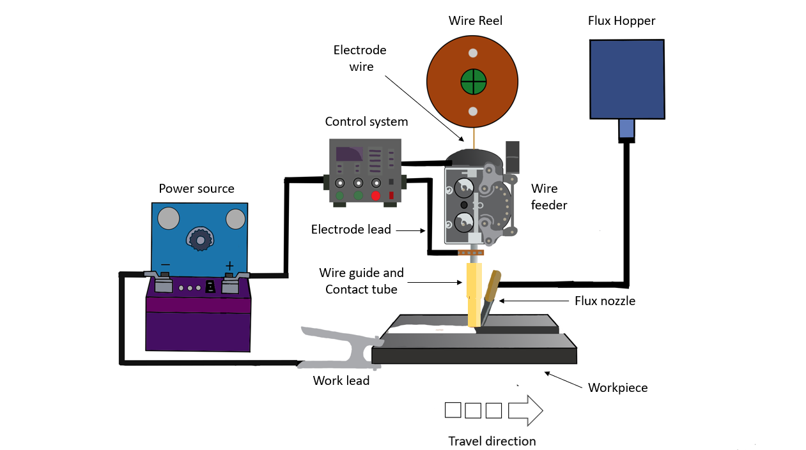
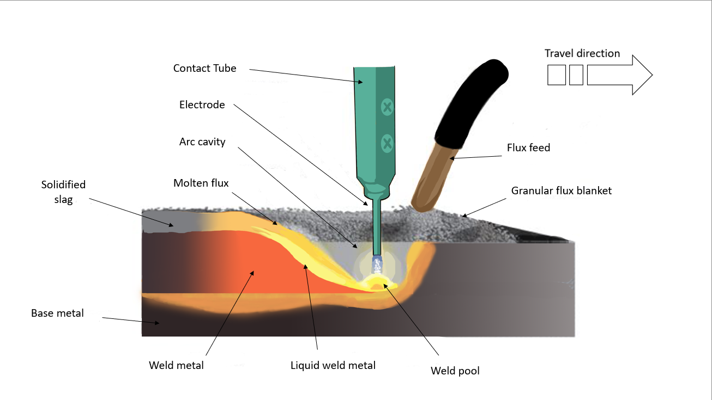

#  Introduction

Submerged arc welding (SAW) is a very effective welding process that joins two or more metal components in various industrial applications such as the Shipbuilding industry and the manufacturing of pressure vessels.  It is an arc welding process in which an electric arc is generated by a continuously-fed wire electrode and the workpiece, while flux granules are fed constantly from the hopper which submerges the welding arc. The flux completely covers the arc and molten metal pool and melts to form a thick layer of slag. The slag in turn shields the molten metal from oxidation and other atmospheric contaminants. This method can join carbon steel, low alloy, stainless steel, and nickel-based alloys. Fig.1 below shows the schematic of the setup of SAW.

####  Fig.1 Schematic of the setup of submerged arc welding

 
                                          

# Theory:
## Working principle:
SAW works by creating an arc between the workpiece and the wire electrode. The wire electrode is fed constantly through a wire spool to the workpiece. Simultaneously, the arc and weld pool is protected from atmospheric contaminants by the slag, which forms by the melting of granular flux. The flux is a mixture of fine powders of materials such as silica, lime, alumina, etc. As the welding arc progresses, the flux surrounding the weld pool melts and flows over the weld pool. The molten flux (slag) protects the weld, retains the heat, and prevents spatter. Later, the molten flux cools and solidifies into a layer of slag that is easily removed after welding. Fig.2 below depicts the cross-sectional view of the workpiece during welding, showing the molten flux, slag, weld pool, etc.

####  Fig.2 Working of a submerged arc welding

## SAW Process parameters:
1. Welding Current: The rate of deposition, penetration depth, and the quantity of molten base metal are all controlled by the welding current or amperage. If the current is too large at a certain velocity, the penetration depth may be excessive. This may lead to the workpiece being melted and forming a hole.   Inversely, insufficient penetration may be observed if the current is lower than adequate, which leads to a lack of fusion. Overall the welding current produces two effects. As the current increases melting rate, penetration and consumption of flux also increases. If a welding current is too low, it may result in an unstable arc.
2. Welding voltage: A high welding voltage results in the formation of a wider weld bead that is susceptible to cracking. It can also make it hard to get rid of slag in groove welds and cause more undercut along the edges of fillet welds. Extremely low welding voltage generates a high, slender bead, making slag removal harder along the bead’s boundaries. By adjusting the voltage to a mean value,  a stable arc is generated, which makes it easier to produce a deep weld penetration and also prevents arc blow. 
3. Welding speed: Rapid weld speeds may cause undercuts, arc blows, voids, and beads with an irregular shape. Relatively slow welding speed allows gases to escape the weld pool, thereby decreasing the porosity. Extremely slow weld speeds may produce uneven bead shape and inclusions of slag.
4. Electrode size: The size of the electrode also affects the deposition rate. For a certain current value, a smaller-diameter electrode will have a higher deposition rate than those of a larger-diameter electrode due to higher current density.  Larger-diameter electrodes, however, can carry greater electrical current than smaller electrodes. Thus higher amperages can be applied, which results in the quicker rate of deposition.

## SAW components:
Submerged arc welding (SAW) requires a number of components to perform the welding process efficiently and effectively. The major components of SAW are:
- ***Electrode wire:*** SAW consists of electrode wire as a filler, wound in the form of a spool. Typically, the thickness of wire ranges from 1.6mm to 6.4mm. Under specific conditions, a twisted wire can be utilized to give the arc an oscillatory motion. Depending on the material to be welded, the electrode composition changes. Generally, copper is used to coat the electrodes to prevent rust and improve electrical conductivity.
- ***Wire feeder:*** It is a device that delivers the welding electrode wire from the spool to the welding torch. It accurately regulates the wire feed velocity to ensure consistent outcomes in the welding process.
- ***Welding torch:*** The welding torch is a device that directs the welding arc onto the workpiece. It typically consists of a nozzle and a contact tip, which can be manually or automatically operated.
- ***Flux:*** The flux consists of a mixture of powders that are agglomerated to form granules. It can be mechanically combined, fused, or bonded. The flux may contain calcium fluorides and oxides of calcium, magnesium, silicon, aluminum, and manganese. The high amount of silica in the flux  leads to easy removal of the slag after the welding process. Welding thicker and thinner pieces requires small and large particle sizes of flux, respectively.
- ***Flux hopper:*** The flux hopper is a container that holds the granular flux used in SAW. It is located above the welding torch and connected to a flux delivery system that feeds onto the workpiece.
- **Carriage:** A carriage guides the welding torch along the weld joint. The carriage is usually attached to a track or rail system that moves it along the weld joint. Depending on the welding application, either a manual or automatic operation is possible for the carriage.
- ***Control Unit:*** The control unit is a device that allows the welding operator to adjust and controls various welding parameters such as welding current, voltage, wire feed speed, and flux delivery rate. It can be done automatically or manually.

## Applications:
Submerged arc welding is a highly versatile welding process that finds application in various industries. Some of the most common applications of SAW are:
1. Shipbuilding: SAW is frequently used to weld large, thick plates in the shipbuilding sector. It is particularly helpful for welding the longitudinal and transverse stiffeners and the hull and deck plates of the ship.
2. Pressure vessel: Boilers, tanks, and reactors are frequently manufactured using SAW. Because of significant shielding from oxidation and contamination offered by flux, it is well suited for welding thick portions of the material.
3. Pipe welding: Large-diameter pipes, especially those used in the oil and gas industry, are frequently welded using SAW. The process produces high-quality, full-penetration welds that are ideal for pipeline applications.

## Advantages
1. High deposition rates (approx. 45kg/hr.)
2. Deep weld penetration
3. flux prevents weld spatter resulting in a clean and sound weld.
4. Edge preparation is not necessary.
5. 50 to 90 percent of the flux can be recovered, repurposed, and utilized again.
6. SAW is easily automated, making it an ideal choice for high-volume welding applications.

## Limitations:
1. Only ferrous metals (steel and stainless steel) and few nickel-based alloys are permitted.
2. Typically restricted to the 1F, 1G positions.
3. SAW is unsuitable for welding in areas with limited joint access, such as tight corners or small openings.
4. SAW is a stationary welding technology that uses large, bulky equipment. It is unsuitable for field welding.

